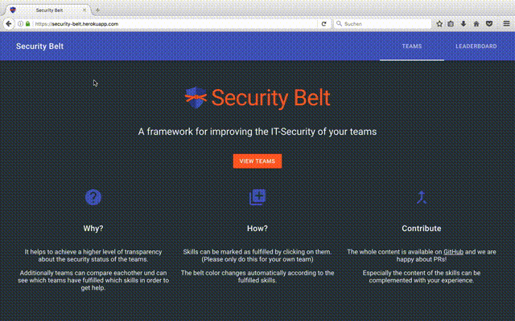

#  Security Belt

[](https://travis-ci.org/philippnormann/security-belt)

A framework for improving the IT-Security of your teams through gamification.
It allows teams to self-asses their security level and rewards them with security belts (from yellow through black). It also ranks the teams by the amount of aquired skills.



## Usage

### Cloning
```bash
git clone https://github.com/philippnormann/security-belt.git
cd security-belt
```
### Building
```bash
npm install
npm test
npm run build
```
For changes to the clients `.js` and `.scss` files to take effect, the static assets need to be rebuilt.

A watch target is included for this purpose:
```bash
npm run build:watch
```
### Prerequisites
You will need a mongoDB for the teams. The database will be automatically seeded once the app is running.

### Docker-Compose
You can use the included docker-compose file, which launches a mongo and a node container for the application. It also mounts the `./data/db` folder as a volume for the database.
```
docker-compose up
```
### Development Setup
You can also start a mongoDB container without a volume like this:
```bash
docker run -d --name belt-mongo -p 27017:27017 mongo
npm install
npm test
npm run build
npm start
```
This is better suited for development since you don't have to rebuild the app container every time.

## Environment Variables

### Databse connection:
- `DB_USER`
- `DB_PASS`
- `DB_NAME`
- `DB_HOST`

### HTTPS redirect:
- `NODE_ENV` = `production`, to enable HTTPS redirect.

## Teams
A team needs to have a security champion. A person from the team who is interested in security and is wants to track the current security status of the team regularly. This person also coordinates the tasks that need to be done, in order to advance.

The team names and security champions are stored in a config file (`config/teams.json`)

You need to edit this file accordingly.

A valid team file should look like this:

```json
{
  "teams": [
    {
      "name": "Team 1",
      "champion": {
        "name": "Chuck Norris",
        "email": "chuck.norris@example.com"
      }
    },
    ...
  ]
}
```


## Skills
All the skills are sorted by colors and written in `.yml` files. (`config/skills`)

It helps to organize a workshop with the security chapions, in order to define a set of skills that make sense in your enviroment.

Please complement the skills and send pull requests.

A valid skill file should look like this:

```yaml
title: A nice title shown in the card
why: Why is this skill useful?
how: How can we reach this goal?
validation: How can we tell we reached the goal?
links:
  - Example: https://example.com
  - Some link in Confluence: https://confluence/?id=234
```

To check if all skills are valid YAML syntax, you can use the included lint target:
```bash
npm run lint:yaml
```

## REST API

### GET `/api/stats?days=[n]`
Get skill progress for all teams over the last n days

Response:

- `x`: Unix epoch timestamp in seconds
- `y`: Total number of completed skills at date `x`

```json
{
  "progress": [
    {
      "x": 1497435199,
      "y": 172
    },
    {
      "x": 1497521599,
      "y": 175
    },
    {
      "x": 1497607999,
      "y": 194
    }
  ]
}
```

### GET `/api/stats/[teamName]?days=[n]`
Get skill progress for a specific team over the last n days

Response:

- `x`: Unix epoch timestamp in seconds
- `y`: Total number of completed skills at date `x`

```json
{
  "progress": [
    {
      "x": 1497435199,
      "y": 30
    },
    {
      "x": 1497521599,
      "y": 34
    },
    {
      "x": 1497607999,
      "y": 38
    }
  ]
}
```

### GET `/api/teams`
Get all teams including their belt and skills

Response:

```json
{
  "teams": [
    {
      "name": "Team Awesome",
      "belt": "white",
      "skills": [
        { 
          "name": "secure_sauce", 
          "since": 1498747187
         },
        ...
      ],
      "skillCount": 1
    },
  ...
  ]
}
```

## Contribution

Contributions are always welcome!

Especially the content of the skills should be complemented with your experience.